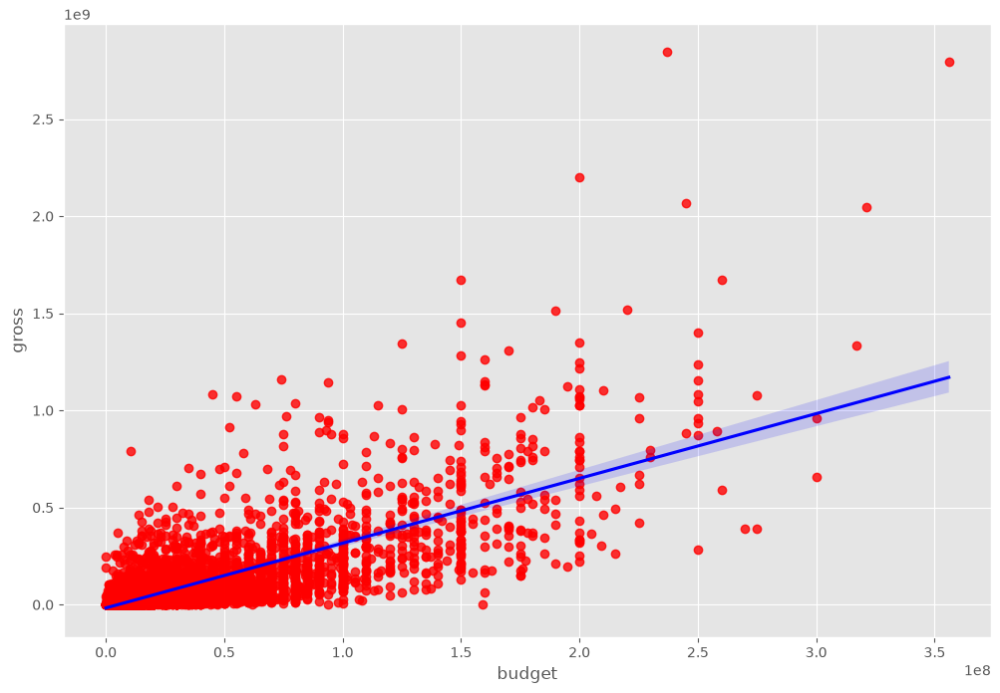
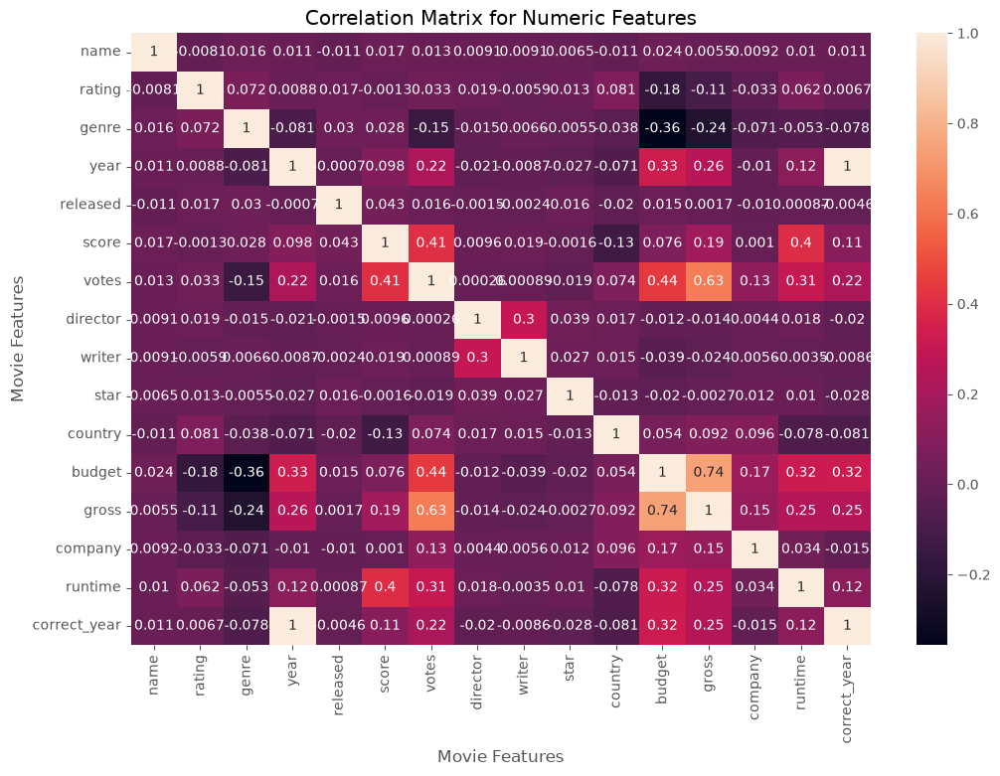

# Movie Correlation Project

A data analysis project exploring what factors correlate most strongly with a movie's box office gross, using a dataset of ~7,600 films (1980s–2020s).

## Overview

This project uses `pandas`, `numpy`, `seaborn`, and `matplotlib` to clean a movies dataset and investigate correlations between features like budget, votes, score, runtime, and gross earnings.

## Visuals

## What it does

- **Data cleaning**
  - Checks for missing values across all columns
  - Fixes data types (`budget`, `gross` cast to `Int64`)
  - Extracts a `correct_year` column from the `released` field via regex, since the original `year` column didn't always match the actual release date
  - Sorts by `gross` and checks for duplicate rows

- **Exploratory analysis**
  - Scatter plot of budget vs. gross earnings
  - Regression plot (`sns.regplot`) of budget vs. gross
  - Correlation matrix (numeric features only) visualized as a heatmap
  - Numerizes categorical columns (`genre`, `director`, `company`, etc.) via category codes to include them in the correlation analysis
  - Unstacks the correlation matrix into sorted pairs to rank feature relationships

## Key findings

- **Budget and gross** show the strongest correlation among numeric features (~0.74)
- **Votes and gross** are also strongly correlated (~0.63)
- Company and budget/votes show a moderate relationship once categorical variables are numerized
- Score, runtime, and released date have comparatively weak correlation with gross

## Dataset

The notebook expects a `movies.csv` file with columns: `name`, `rating`, `genre`, `year`, `released`, `score`, `votes`, `director`, `writer`, `star`, `country`, `budget`, `gross`, `company`, `runtime`.
